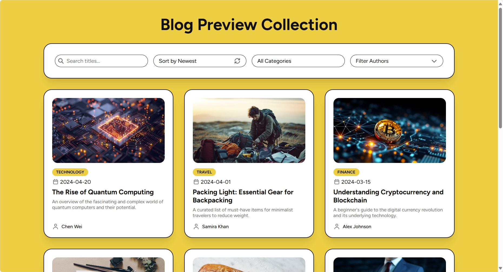

# Blog Preview Card Extension - Blog Preview Collection
This is an extension of the [Blog Preview Card](https://www.frontendmentor.io/solutions/blog-preview-card-pHA7bfGQ9B) challenge from [Frontend Mentor](https://www.frontendmentor.io/challenges/blog-preview-card-ckPaj01IcS). This project transforms the original static design into search, sort, and filter system. 

## Features
- **Search:** Users can search for specific articles by typing into the search bar, which filters content by the article's title.
- **Sort:** Articles can be sorted in ascending or descending order based on their publish date.
- **Filtering:**
  - **Categories:** Filter articles by a single category using a dropdown menu.
  - **Authors:** Filter articles by one or more authors using a multi-select checkbox menu.
- **Responsive Design:** The layout is optimized for both desktop and mobile devices.

## Card Structure
Each blog preview card is a self-contained component with the following elements:
- **Image:** A preview image for the article.
- **Category:** The article's category, displayed as a rounded tag.
- **Publish Date:** The date the article was published.
- **Title:** The main heading for the article.
- **Description:** A short summary of the article's content.
- **Author:** The name of the author who wrote the article.

## Default Settings
- **Search:** The search bar is empty, and no search filter is applied.
- **Sorting:** The articles are sorted by "Newest" publish date, which is descending order.
- **Categories:** The "All Categories" option is selected, showing all articles regardless of their category.
- **Authors:** All authors are displayed, as none are selected.

## Author
- GitHub Profile: [PresidentTree94](https://github.com/PresidentTree94)
- Frontend Mentor Profile: [PresidentTree94](https://www.frontendmentor.io/profile/PresidentTree94)
- Author Website: [PresidentTree94 Portfolio](https://presidenttree94.github.io/project-portfolio/)